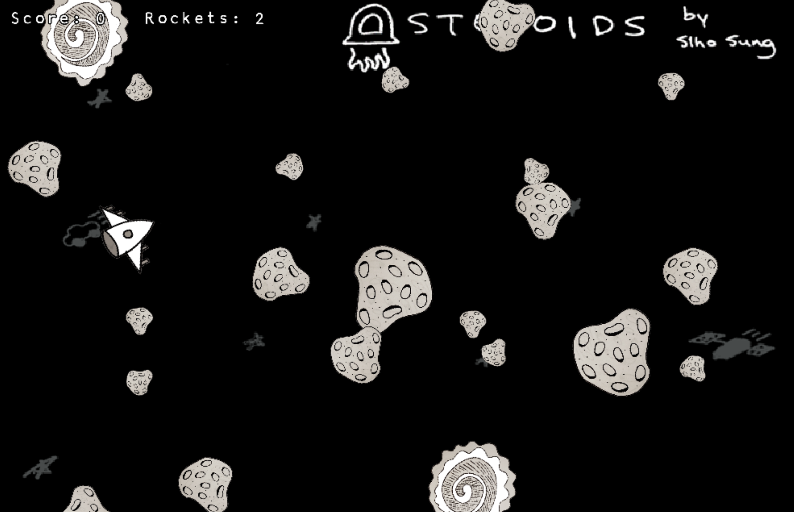
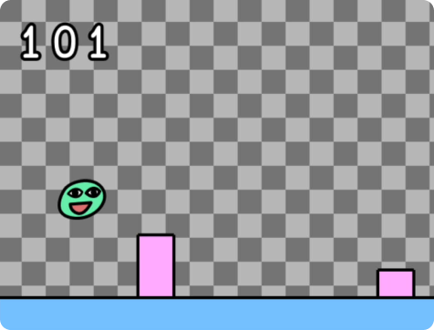
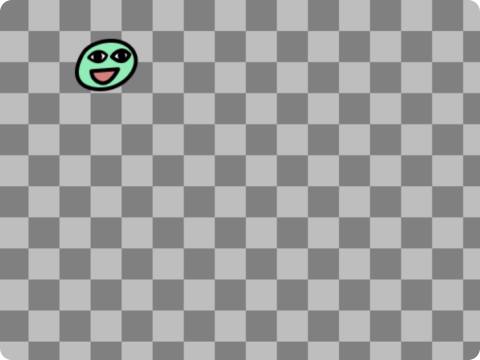
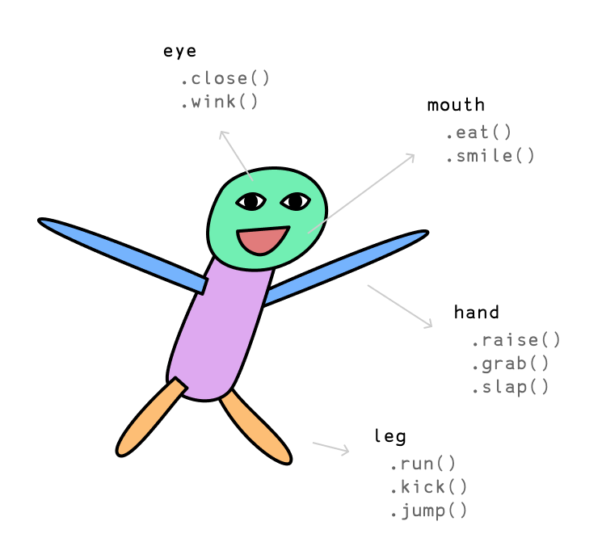
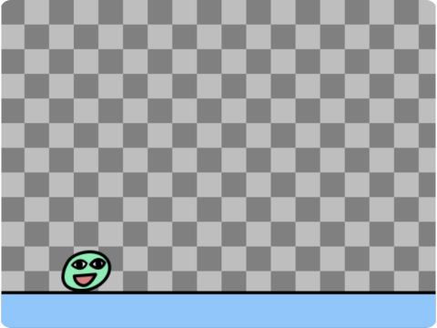
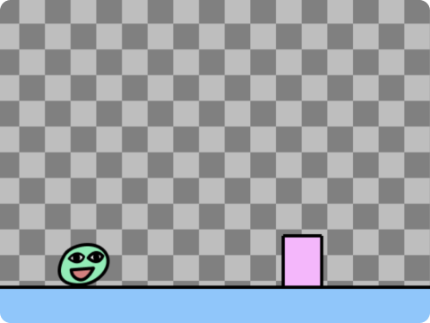
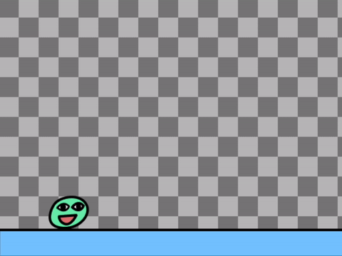
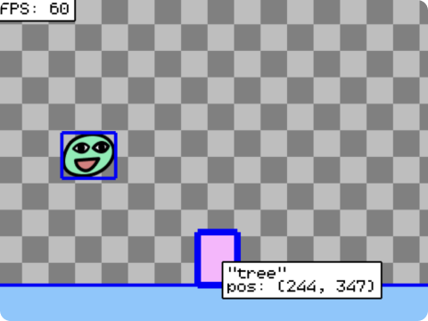

Welcome! Kaboom is a JavaScript library that helps you make games fast and fun :D

This is an intro tutorial that will cover the basic concepts and make a very simple [Chrome Dino](https://en.wikipedia.org/wiki/Dinosaur_Game) - ish game.



(scroll to bottom to see / copy the full game code)

Let's start by initializing the context with the `kaboom()` function.

```js
kaboom()
```

This should give you a blank canvas with a nice checkerboard pattern like this


Then let's add some stuff to screen, like an image. Copy this piece of code to your editor and see what happens when you run the game.

```js
// load a sprite "bean" from an image
loadSprite("bean", "sprites/bean.png")

// add something to screen
add([
	sprite("bean"),
	pos(80, 40),
])
```

Introducing Frog the "Bean"! A happy frog that enjoys life. You'll see Bean a lot around here.



Before explaining what this code does, let's try adding some more stuff to it and see what happens:

```js
// add something to screen
add([
	sprite("bean"),
	pos(80, 40),
	scale(3),
	rotate(30),
	color(0, 0, 255),
])
```

Feel free to tweak some parameters and see how it affects what happens on screen.

In Kaboom, each game object is composed from multiple components. Each component will give the game obj certain functionality.

> A game object is basically any character in the game, like the player character, a bullet, a rock, a cloud

For example, some component might decide what's the shape, some components might decide if it should subject to gravity, some components might decide what color it is, some component might decide how long it can live.


If you're having trouble understanding, consider this Human Bean:



Human are also composed from a list of components, each component provides different functionalities, which is exactly what component means in Kaboom. `add()` is the function you use to assemble all the components into a game object in kaboom:


It's actually kinda like playing with lego pieces! Let's keep this in mind and start making the actual player character in our game:

```js
// putting together our player character
const bean = add([
	sprite("bean"),
	pos(80, 40),
	area(),
	body(),
])

// .jump() when "space" key is pressed
onKeyPress("space", () => {
	bean.jump()
})
```

Let's see what components we're using:
- `sprite()` makes it render as a sprite, with the `"bean"` sprite we just loaded with `loadSprite()`
- `pos()` gives it a position on screen, at X: 80 Y: 40
- `area()` gives it a collider area, so we can check for collisions with other characters later on
- `body()` gives it a physical body, making it fall due to gravity and ability to jump

We're also testing out our player character with a little interaction here. `onKeyPress()` registers an event that runs every time user presses a certain key. In this case, we're calling the `.jump()` method (which is provided by the `body()` component) when `"space"` key is pressed. Go ahead and slap that space key!

With the `body()` component, our Bean is going to keep falling into oblivion if we don't hit "space" key enough. Let's add a solid platform for Bean to land on.

```js
// add platform
add([
	rect(width(), 48),
	pos(0, height() - 48),
	outline(4),
	area(),
	solid(),
	color(127, 200, 255),
])
```

Woah! That looks like a lot, but it's actually really simple, let's look at each component

- `rect()` renders a triangle. It accepts 2 arguments, the width and height, which we give it the game width (returned by `width()`) and height of 48 pixels
- `pos()` position. We give it a x: 0 and y: `height() - 48` so it sits right on the bottom of the screen
- `outline()` renders an outline of `4` pixels
- `area()` adds a collider to it
- `solid()` makes other objects impossible to pass through
- `color()` makes it render with an RGB color, we give it a R: 127 G: 200 B: 255 which is a blue-ish color

Pretty straightforward! Refresh the game and you should see our Bean is now safely landed on a solid blue platform.



Let's also make sure our Bean can only jump when grounded.

```js
onKeyPress("space", () => {
	if (bean.grounded()) {
		bean.jump();
	}
});
```

`grounded()` is another function provided by `body()` component which checks if currently landed on a platform. Now our game is slightly more physically correct.

Bean loves challanges. Let's start adding in obstacles to jump over! Time to build a game object from components again.

```js
// add tree
add([
	rect(48, 64),
	area(),
	outline(4),
	pos(width(), height() - 48),
	origin("botleft"),
	color(255, 180, 255),
	move(LEFT, 240),
]);
```

A lot of these we have already seen you should know what they do, but some new ones here:
- `origin()` defines the origin point of positioning. By default `pos()` defines the top left point of the shape, here we change it to the bottom left point because we want it to be just above the platform, so we give it Y position of `height() - 48`
- `move()` makes it move towards a direction infinitely. In this case we move towards the `LEFT` by `480` pixels per second



Challenger appears! Try jumping over it.

Oh but it's.. not really fun! Or rather, there's no feedback to whether we managed to jump over the ramp. Let's add some feedback.

To do this we'll need to check for collision between the two.

First we'll need to give the tree a tag. Any game object can have any number of tags, they're kinda like components but much more light weight. We often use tags to quickly describe behaviors for a group of objects.

```js
// add tree
add([
	rect(48, 64),
	area(),
	outline(4),
	pos(width(), height() - 48),
	origin("botleft"),
	color(255, 180, 255),
	move(LEFT, 240),
	"tree", // add a tag here
]);
```

To add a tag we simply put a string in the component array. Then we can check for collision between Bean and any object with tag "tree".

```js
bean.onCollide("tree", () => {
	addKaboom(bean.pos);
	shake();
});
```

`.onCollide()` is a function provided by the `area()` component. It registers an event that runs every time the object collides with another object with a certain tag, passed by the first argument. In this case, it means every time Bean collides with another game obj with tag `"tree"`, run the callback.

Inside the callback we're doing 2 things. `addKaboom()` spawns an explosion animation which is basically kaboom's logo, it accepts 1 argument the position to spawn, which we pass in the player's current position with `.pos` (which is provided by the `pos()` component).

The second thing is `shake()`, which just shakes the screen,



Here's a trick. Try pressing `F1` in the game. See all the blue outlines? This is inspect mode and it'll show all the bounding boxes of every game obj with `area()` component. Also try hovering over each game object to inspect its states like position and tags.



Now it's time to add more trees. How can we keep them spawning constantly?

Let's try the `loop()` function, which performs an action every x seconds.

```js
loop(1, () => {
	// add tree
	add([
		rect(48, 64),
		area(),
		outline(4),
		pos(width(), height() - 48),
		origin("botleft"),
		color(255, 180, 255),
		move(LEFT, 240),
		"tree", // add a tag here
	]);
});
```

Let's just put the tree adding code inside a `loop()`. The first argument is the time in seconds here, so it'll spawn a tree every 1 seconds.

Sick! Lots of trees coming to you now. Now we already have most of the game mechanics done. Some improvements we can make:

1. It might be better if trees all have different random heights. We can use `rand()` to assign different value to the tree's rect height:

```js
rect(48, rand(24, 64)),
```

2. It'll be more fun if the trees spawn at different intervals. We cannot do that from `loop()`, but we can compose that with recursive `wait()`s, which waits for x seconds to execute some code.

```js
function spawnTree() {
	add([
		// the tree components
	]);
	wait(rand(0.5, 1.5), () => {
		spawnTree();
	});
}

spawnTree();
```

See? We're calling `spawnTree()` recursively / endlessly, with a random interval between 0.5 - 1.5 seconds each time.

Before adding a score counter, let's actually complete the game loop first, by sending player to a gameover scene when they hit a tree. We can achieve this with kaboom's `scene()` system

```js
scene("game", () => {
	add([
		sprite("bean"),
	])
})

scene("lose", () => {
	add([
		text("Game Over"),
	])
})

go("game")
```

Consider this example above, we're declaring 2 scenes here, "game" and "lose". The function we pass to `scene()` is the function to run when this scene is activated (by `go()`). In this case, we want to add a "bean" sprite on "game" scene, and want to add a "Game Over" text on the "lose" scene.

Let's first move everything game code we have into a scene.

```js
// don't move these init / loader functions
kaboom()
loadSprite("bean", "sprites/bean.png");

scene("game", () => {
	// add bean
	// add platform
	// spawn trees
});

go("game")
```

Try this, this shouldn't change any of your game's content.

Then we can add a "lose" scene independent to your core game content here.

```js
scene("lose", () => {
	add([
		text("Game Over"),
		pos(center()),
		origin("center"),
	])
})
```

So in the "lose" scene, we'll add a piece of text in the center says "Game Over" (`text()` is a component that renders text). Go ahead and go to this scene when player collides with a tree:

```js
player.onCollide("tree", () => {
	addKaboom(bean.pos);
	shake();
	go("lose"); // go to "lose" scene here
});
```

Ok! Now we've arrived at the final part of our game: score counter.

```js
let score = 0;
const scoreLabel = add([
	text(score),
	pos(24, 24)
])
```

Here we've declared a number variable to store the score, and added a game obj with `text()` component to display the text.

Let's keep it simple and just use time as score.

```js
// increment score every frame
onUpdate(() => {
	score++;
	scoreLabel.text = score;
});
```

We can use the `onUpdate()` function, which takes a function, and runs it every frame. In this case we're going to increment the score, and update the score label's text every frame.

(todo)

Full game code here:

```js
import kaboom from "kaboom";

const FLOOR_HEIGHT = 48;
const JUMP_FORCE = 800;
const SPEED = 480;

// initialize context
kaboom();

// load assets
loadSprite("bean", "sprites/bean.png");

scene("game", () => {

	// define gravity
	gravity(2400);

	// add a game object to screen
	const player = add([
		// list of components
		sprite("bean"),
		pos(80, 40),
		area(),
		body(),
	]);

	// floor
	add([
		rect(width(), FLOOR_HEIGHT),
		outline(4),
		pos(0, height()),
		origin("botleft"),
		area(),
		solid(),
		color(127, 200, 255),
	]);

	function jump() {
		if (player.grounded()) {
			player.jump(JUMP_FORCE);
		}
	}

	// jump when user press space
	onKeyPress("space", jump);
	onClick(jump);

	function spawnTree() {

		// add tree obj
		add([
			rect(48, rand(32, 96)),
			area(),
			outline(4),
			pos(width(), height() - FLOOR_HEIGHT),
			origin("botleft"),
			color(255, 180, 255),
			move(LEFT, SPEED),
			"tree",
		]);

		// wait a random amount of time to spawn next tree
		wait(rand(0.5, 1.5), spawnTree);

	}

	// start spawning trees
	spawnTree();

	// lose if player collides with any game obj with tag "tree"
	player.onCollide("tree", () => {
		// go to "lose" scene and pass the score
		go("lose", score);
		burp();
		addKaboom(player.pos);
	});

	// keep track of score
	let score = 0;

	const scoreLabel = add([
		text(score),
		pos(24, 24),
	]);

	// increment score every frame
	onUpdate(() => {
		score++;
		scoreLabel.text = score;
	});

});

scene("lose", (score) => {

	add([
		sprite("bean"),
		pos(width() / 2, height() / 2 - 80),
		scale(2),
		origin("center"),
	]);

	// display score
	add([
		text(score),
		pos(width() / 2, height() / 2 + 80),
		scale(2),
		origin("center"),
	]);

	// go back to game with space is pressed
	onKeyPress("space", () => go("game"));
	onClick(() => go("game"));

});

go("game");
```
